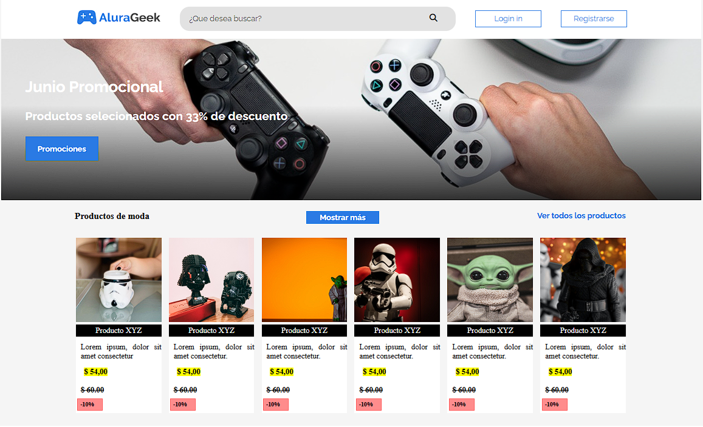

# Desafio_3_AluraLatam_G4_Front-End_e-commerce
Vea: e-commerce website https://jairo51067.github.io/Desafio_3_AluraLatam_G4_Front-End_e-commerce/



# AluraGeek e-Commerce Website
Este es un proyecto de una tienda en línea (e-commerce) que permite a los usuarios explorar productos de diferentes categorías como "Productos de moda", "Consolas" y "Diversos". Está diseñado para mostrar las habilidades de desarrollo web, incluyendo HTML, CSS y JavaScript.

## Características:
- **Interfaz de usuario atractiva** con navegación fluida.
- **Búsqueda interactiva** para encontrar productos rápidamente.
- **Estructura responsiva** para adaptarse a dispositivos móviles y de escritorio.
- **Lista dinámica de productos** en diferentes categorías.
- **Promociones destacadas** con descuentos visibles.
- **Formulario de contacto** para interactuar con los usuarios.

## Tecnologías utilizadas:
- HTML5
- CSS3
- JavaScript (con manejo básico de eventos)
- FontAwesome (para íconos)
- Google Fonts (para fuentes tipográficas)

## Instalación
1. Clona el repositorio:
    ```bash
    git clone https://github.com/usuario/nombre_del_proyecto.git
    ```
2. Abre el archivo `index.html` en tu navegador web preferido para ver el proyecto.

## Cómo Contribuir
Si deseas contribuir a este proyecto, por favor realiza lo siguiente:
1. Forkea el repositorio.
2. Crea una nueva rama (`git checkout -b nombre-de-la-rama`).
3. Realiza tus cambios.
4. Envía un pull request con una descripción clara de los cambios realizados.

Agradezco cualquier sugerencia o mejora. No dudes en abrir un "issue" o enviar un "pull request".

## Licencia
Especifica la licencia bajo la cual se distribuye el proyecto (por ejemplo, MIT, GPL-3.0, etc.).

## Autor
Si tienes alguna pregunta o quieres ponerte en contacto conmigo, puedes hacerlo a través de:
- Correo electrónico: jairo.cardenas.dev@gmail.com 
- GitHub: [@jairo51067](https://github.com/jairo51067). 

